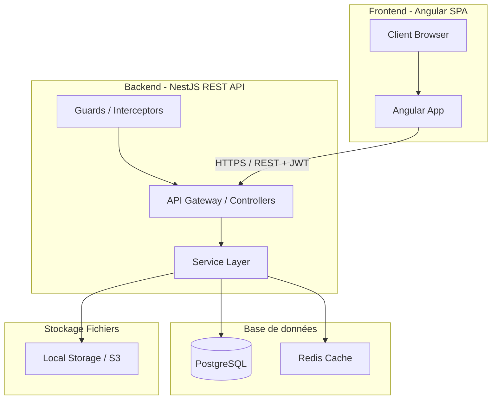
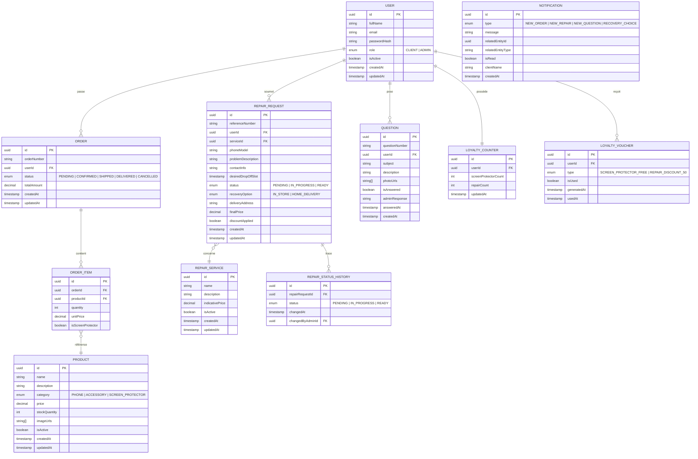
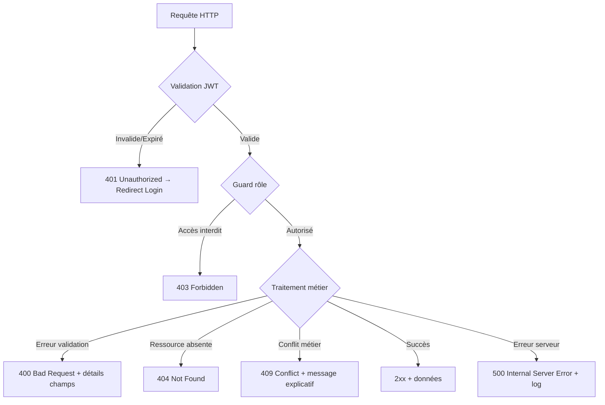
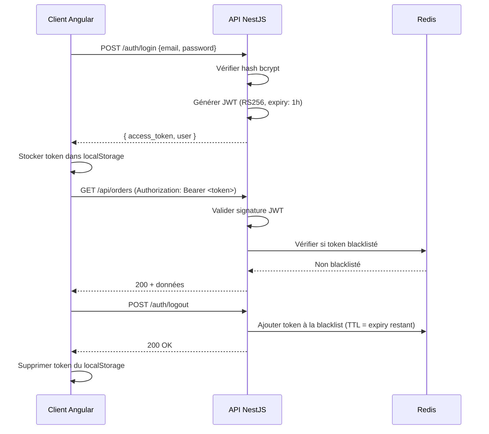
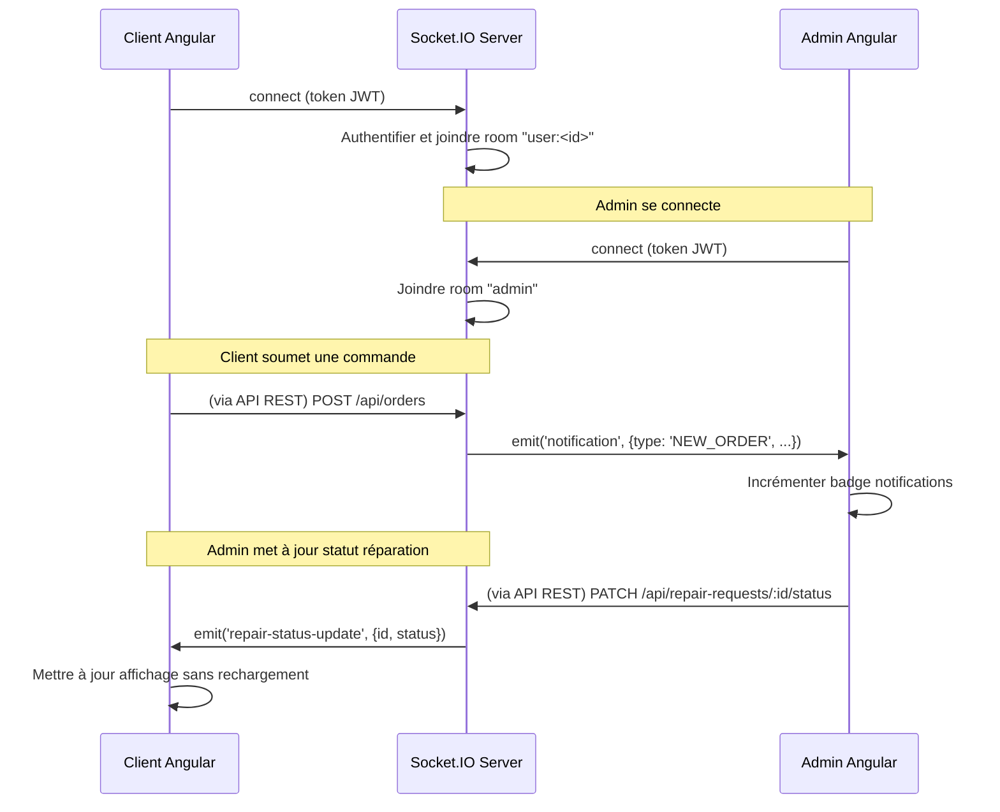

# Document de Design Technique – Phone Shop App

## Vue d'ensemble

### Objectif

L'application **Phone Shop App** est une plateforme e-commerce full-stack destinée à une boutique de téléphones. Elle expose deux interfaces distinctes :

- **Interface Client** : navigation dans le catalogue, panier, commandes, demandes de réparation, suivi en temps réel, programme de fidélité, espace questions/diagnostic.
- **Interface Admin** : tableau de bord avec notifications, gestion des produits, utilisateurs, commandes, réparations, services et questions.

### Charte Graphique

Inspirée du logo `LOGO.png` de la boutique, la palette repose sur un **bleu primaire profond** et un **jaune accent dynamique**, évoquant modernité et confiance.

#### Palette de couleurs

| Rôle           | Nom              | Valeur hexadécimale |
|----------------|------------------|---------------------|
| Primaire       | Deep Blue        | `#1A237E`           |
| Primaire clair | Blue             | `#1565C0`           |
| Accent         | Golden Yellow    | `#FFB300`           |
| Accent clair   | Light Yellow     | `#FFD54F`           |
| Surface        | White            | `#FFFFFF`           |
| Surface alt    | Light Gray       | `#F5F7FA`           |
| Texte primaire | Dark Gray        | `#1C1C2E`           |
| Texte secondaire | Gray           | `#6B7280`           |
| Succès         | Green            | `#22C55E`           |
| Avertissement  | Orange           | `#F59E0B`           |
| Erreur         | Red              | `#EF4444`           |
| Info           | Cyan             | `#06B6D4`           |

#### Typographie

- **Titres (H1–H3)** : `Poppins`, semi-bold / bold — moderne et géométrique
- **Corps de texte** : `Inter`, regular / medium — très lisible à toutes tailles
- **Code / données** : `JetBrains Mono`, regular

```css
/* Import Google Fonts */
@import url('https://fonts.googleapis.com/css2?family=Poppins:wght@400;600;700&family=Inter:wght@400;500;600&display=swap');
```

#### Composants UI réutilisables

- **Boutons** : Primaire (bleu plein), Secondaire (contour bleu), Accent (jaune), Danger (rouge) — avec transition `ease-in-out 200ms` et effet `hover:scale-105`
- **Cartes produits** : ombre douce, coin arrondi `16px`, badge de statut coloré (dispo/indispo)
- **Badges de statut** : pill-shaped, couleur selon état (vert=prêt, orange=en cours, gris=en attente)
- **Navbar** : fond bleu foncé `#1A237E`, logo + navigation + panier + avatar utilisateur
- **Animations** : `@angular/animations` — transitions de routes (fade-slide), entrée des cartes (staggered), spinner de chargement
- **Formulaires** : labels flottants, validation en temps réel, messages d'erreur inline

---

## Architecture

### Vue d'ensemble de l'architecture

L'application adopte une architecture **3-tiers** classique avec découplage strict entre les couches.



### Choix technologiques

| Couche         | Technologie         | Justification |
|----------------|---------------------|---------------|
| Frontend       | Angular 17+         | Requis par le cahier des charges |
| Backend        | NestJS (Node.js)    | Modules typés, décorateurs, cohérence TypeScript full-stack |
| Base de données | PostgreSQL          | Relations complexes (users/orders/repairs), intégrité transactionnelle |
| Cache / Sessions | Redis             | Gestion de la liste noire des tokens JWT invalidés |
| ORM            | TypeORM             | Intégration native NestJS + PostgreSQL |
| Authentification | JWT (RS256)        | Stateless, scalable, supporte l'invalidation via Redis |
| Temps réel     | WebSocket (Socket.IO) | Notifications admin et suivi réparation en temps réel |
| Stockage photos | Multer + disque local (ou S3 en prod) | Upload photos Questions |

### Justification PostgreSQL vs MongoDB

PostgreSQL est choisi car le domaine métier présente de nombreuses **relations fortes** :
- Un utilisateur possède plusieurs commandes, réparations, questions
- Une commande référence plusieurs produits (table de jonction)
- Le programme de fidélité comptabilise des entités liées à des commandes

MongoDB serait inadapté car ces relations nécessiteraient des jointures complexes ou une duplication de données. PostgreSQL garantit l'intégrité référentielle et supporte les transactions ACID requises pour la gestion des stocks et du programme de fidélité.

---

## Composants et Interfaces

### Structure des modules Angular

```mermaid
graph TD
    AppModule --> CoreModule
    AppModule --> SharedModule
    AppModule --> AuthModule
    AppModule --> ClientModule
    AppModule --> AdminModule

    CoreModule --> AuthGuard
    CoreModule --> AdminGuard
    CoreModule --> JwtInterceptor
    CoreModule --> ErrorInterceptor

    SharedModule --> ButtonComponent
    SharedModule --> CardComponent
    SharedModule --> BadgeComponent
    SharedModule --> NavbarComponent
    SharedModule --> SpinnerComponent
    SharedModule --> ModalComponent
    SharedModule --> PaginationComponent

    AuthModule --> LoginPage
    AuthModule --> RegisterPage

    ClientModule --> HomeModule
    ClientModule --> CatalogModule
    ClientModule --> ProductDetailModule
    ClientModule --> CartModule
    ClientModule --> OrdersModule
    ClientModule --> RepairModule
    ClientModule --> LoyaltyModule
    ClientModule --> QuestionsModule

    AdminModule --> DashboardModule
    AdminModule --> AdminUsersModule
    AdminModule --> AdminProductsModule
    AdminModule --> AdminOrdersModule
    AdminModule --> AdminRepairsModule
    AdminModule --> AdminQuestionsModule
    AdminModule --> AdminNotificationsModule
```



### Routing Angular

```typescript
// app-routing.module.ts
const routes: Routes = [
  { path: '', redirectTo: '/home', pathMatch: 'full' },

  // Auth
  { path: 'login', component: LoginPage },
  { path: 'register', component: RegisterPage },

  // Client (lazy-loaded)
  {
    path: '',
    canActivate: [ClientGuard],
    children: [
      { path: 'home', loadChildren: () => import('./client/home/home.module') },
      { path: 'catalog', loadChildren: () => import('./client/catalog/catalog.module') },
      { path: 'product/:id', loadChildren: () => import('./client/product-detail/product-detail.module') },
      { path: 'cart', loadChildren: () => import('./client/cart/cart.module') },
      { path: 'orders', loadChildren: () => import('./client/orders/orders.module') },
      { path: 'repairs', loadChildren: () => import('./client/repair/repair.module') },
      { path: 'loyalty', loadChildren: () => import('./client/loyalty/loyalty.module') },
      { path: 'questions', loadChildren: () => import('./client/questions/questions.module') },
    ]
  },

  // Admin (lazy-loaded, rôle Admin requis)
  {
    path: 'admin',
    canActivate: [AdminGuard],
    children: [
      { path: '', redirectTo: 'dashboard', pathMatch: 'full' },
      { path: 'dashboard', loadChildren: () => import('./admin/dashboard/dashboard.module') },
      { path: 'users', loadChildren: () => import('./admin/users/users.module') },
      { path: 'products', loadChildren: () => import('./admin/products/products.module') },
      { path: 'orders', loadChildren: () => import('./admin/orders/orders.module') },
      { path: 'repairs', loadChildren: () => import('./admin/repairs/repairs.module') },
      { path: 'questions', loadChildren: () => import('./admin/questions/questions.module') },
      { path: 'notifications', loadChildren: () => import('./admin/notifications/notifications.module') },
    ]
  },

  { path: '**', redirectTo: '/home' }
];
```

### Guards Angular

```typescript
// auth.guard.ts — Redirige vers /login si non authentifié
@Injectable({ providedIn: 'root' })
export class AuthGuard implements CanActivate {
  canActivate(): boolean {
    if (!this.authService.isAuthenticated()) {
      this.router.navigate(['/login']);
      return false;
    }
    return true;
  }
}

// admin.guard.ts — Redirige vers /home si rôle != Admin
@Injectable({ providedIn: 'root' })
export class AdminGuard implements CanActivate {
  canActivate(): boolean {
    const user = this.authService.currentUser();
    if (!user || user.role !== 'ADMIN') {
      this.router.navigate(['/home']);
      return false;
    }
    return true;
  }
}

// client.guard.ts — Redirige vers /admin si rôle == Admin
@Injectable({ providedIn: 'root' })
export class ClientGuard implements CanActivate {
  canActivate(): boolean {
    const user = this.authService.currentUser();
    if (user?.role === 'ADMIN') {
      this.router.navigate(['/admin/dashboard']);
      return false;
    }
    return true;
  }
}
```

### Intercepteurs Angular

```typescript
// jwt.interceptor.ts — Injecte le token JWT dans chaque requête HTTP
// error.interceptor.ts — Gestion globale des erreurs (401 → logout, 403 → forbidden page)
```

### Structure des pages

#### Interface Client

| Page               | Route                | Description |
|--------------------|----------------------|-------------|
| Accueil            | `/home`              | Hero banner, catégories, services mis en avant |
| Catalogue          | `/catalog`           | Liste produits avec filtres et recherche |
| Détail produit     | `/product/:id`       | Images, description, prix, bouton panier |
| Panier             | `/cart`              | Articles, quantités, total, validation commande |
| Mes Commandes      | `/orders`            | Historique avec statuts |
| Réparations        | `/repairs`           | Liste services + formulaire demande + suivi |
| Fidélité           | `/loyalty`           | Compteurs, bons actifs, progression |
| Questions          | `/questions`         | Formulaire question + historique + réponses |

#### Interface Admin

| Page               | Route                     | Description |
|--------------------|---------------------------|-------------|
| Tableau de bord    | `/admin/dashboard`        | Stats, notifications non lues, actions rapides |
| Utilisateurs       | `/admin/users`            | Liste paginée, recherche, modification rôle, désactivation |
| Produits           | `/admin/products`         | Liste paginée, ajout/modif/suppression |
| Commandes          | `/admin/orders`           | Liste, mise à jour statut |
| Réparations        | `/admin/repairs`          | Liste, mise à jour statut, historique |
| Questions          | `/admin/questions`        | Liste, consultation, réponse |
| Notifications      | `/admin/notifications`    | Liste triée par date, marquage lu |

---

## Modèles de Données

### Diagramme Entité-Relation



### Schémas TypeScript (DTOs / Entités)

```typescript
// Entité User
interface User {
  id: string;
  fullName: string;
  email: string;
  passwordHash: string;
  role: 'CLIENT' | 'ADMIN';
  isActive: boolean;
  createdAt: Date;
}

// Entité Product
interface Product {
  id: string;
  name: string;
  description: string;
  category: 'PHONE' | 'ACCESSORY' | 'SCREEN_PROTECTOR';
  price: number;
  stockQuantity: number;
  imageUrls: string[];
  isActive: boolean;
}

// Entité RepairRequest
interface RepairRequest {
  id: string;
  referenceNumber: string;
  userId: string;
  serviceId: string;
  phoneModel: string;
  problemDescription: string;
  status: 'PENDING' | 'IN_PROGRESS' | 'READY';
  recoveryOption?: 'IN_STORE' | 'HOME_DELIVERY';
  deliveryAddress?: string;
  finalPrice: number;
  discountApplied: boolean;
}

// Entité Notification
interface Notification {
  id: string;
  type: 'NEW_ORDER' | 'NEW_REPAIR' | 'NEW_QUESTION' | 'RECOVERY_CHOICE';
  message: string;
  relatedEntityId: string;
  isRead: boolean;
  clientName: string;
  createdAt: Date;
}
```

---

## Propriétés de Correction

*Une propriété est une caractéristique ou un comportement qui doit rester vrai pour toutes les exécutions valides d'un système — c'est essentiellement un énoncé formel de ce que le système doit faire. Les propriétés servent de pont entre les spécifications lisibles par un humain et les garanties de correction vérifiables par une machine.*

### Propriété 1 : Rejet des mots de passe trop courts

*Pour tout* mot de passe composé de moins de 8 caractères, la tentative d'inscription doit être rejetée et aucun compte ne doit être créé.

**Valide : Exigence 1.4**

---

### Propriété 2 : Unicité des adresses email

*Pour tout* ensemble de comptes existants et toute adresse email déjà enregistrée, soumettre une demande d'inscription avec cette adresse doit toujours être rejeté avec un message d'erreur.

**Valide : Exigence 1.3**

---

### Propriété 3 : Filtrage catalogue par catégorie

*Pour tout* filtre de catégorie appliqué, tous les produits retournés doivent appartenir exclusivement à cette catégorie — aucun produit hors-catégorie ne doit apparaître.

**Valide : Exigence 2.4**

---

### Propriété 4 : Produits hors stock désactivés

*Pour tout* produit dont le stock est à zéro, le bouton "Ajouter au panier" doit être désactivé et le produit affiché comme indisponible.

**Valide : Exigence 2.7**

---

### Propriété 5 : Cohérence du total panier

*Pour tout* panier contenant n articles de quantités et de prix quelconques, le total affiché doit toujours être égal à la somme des (quantité × prix unitaire) de chaque article.

**Valide : Exigence 4.2**

---

### Propriété 6 : Compteur de fidélité protège-écran

*Pour tout* client ayant un compteur de protège-écrans k, après validation d'une commande contenant m protège-écrans, le nouveau compteur doit être k + m.

**Valide : Exigences 9.1, 9.2**

---

### Propriété 7 : Génération de bon fidélité aux multiples de 5

*Pour tout* compteur de protège-écrans ou de réparations atteignant un multiple de 5, un bon de réduction doit être généré — ni plus tôt ni plus tard.

**Valide : Exigences 9.3, 10.3**

---

### Propriété 8 : Cohérence du décrément de fidélité

*Pour tout* client ayant un compteur k et annulant une commande contenant m protège-écrans, le nouveau compteur doit être k − m (sans passer en dessous de 0).

**Valide : Exigence 9.6**

---

### Propriété 9 : Statut de réparation — progression strictement croissante

*Pour tout* statut de réparation courant, tenter d'assigner un statut antérieur dans le flux (READY → IN_PROGRESS, IN_PROGRESS → PENDING, READY → PENDING) doit toujours être rejeté.

**Valide : Exigence 12.6**

---

### Propriété 10 : Validation des fichiers photos

*Pour tout* fichier soumis dans une Question, si son format n'est pas JPEG/PNG/WEBP ou si sa taille dépasse 5 Mo, la soumission doit être rejetée et aucune photo ne doit être enregistrée.

**Valide : Exigences 14.4, 14.5**

---

### Propriété 11 : Isolation des rôles

*Pour tout* utilisateur authentifié avec le rôle CLIENT, toute requête vers une route `/admin/**` doit être rejetée (HTTP 403 ou redirection).

**Valide : Exigences 1.9, 13.4**

---

### Propriété 12 : Validation prix produit

*Pour tout* prix soumis lors de la création ou modification d'un produit, si le prix est négatif ou égal à zéro, la requête doit être rejetée.

**Valide : Exigence 6.3**

---

### Propriété 13 : Cohérence du compteur de notifications non lues

*Pour tout* ensemble de notifications admin, le compteur de notifications non lues affiché dans le tableau de bord doit toujours être égal au nombre de notifications dont l'attribut `isRead` est `false`.

**Valide : Exigence 15.5, 15.7**

---

### Propriété 14 : Incrément du compteur de réparations fidélité

*Pour tout* client ayant un compteur de réparations r, lorsqu'une demande de réparation passe au statut "Téléphone prêt", le nouveau compteur doit être r + 1.

**Valide : Exigences 10.1, 10.2**

---

### Stratégie globale



### Codes d'erreur métier

| Code HTTP | Scénario | Message type |
|-----------|----------|--------------|
| 400 | Champ manquant / invalide | `"Le champ 'email' est requis"` |
| 400 | Prix négatif ou nul | `"Le prix doit être supérieur à 0"` |
| 400 | Format fichier invalide | `"Format non supporté. Acceptés : JPEG, PNG, WEBP"` |
| 400 | Taille fichier dépassée | `"Taille maximale : 5 Mo par fichier"` |
| 400 | Statut réparation régressif | `"Le statut ne peut pas régresser vers 'En attente'"` |
| 401 | Token expiré ou absent | `"Session expirée. Veuillez vous reconnecter."` |
| 403 | Accès refusé par rôle | `"Accès interdit"` |
| 409 | Email déjà utilisé | `"Cette adresse email est déjà associée à un compte"` |
| 409 | Suppression produit en commande | `"Ce produit est lié à des commandes actives : #CMD-001"` |
| 409 | Admin se désactive lui-même | `"Impossible de désactiver votre propre compte"` |

### Gestion côté Angular

```typescript
// error.interceptor.ts
@Injectable()
export class ErrorInterceptor implements HttpInterceptor {
  intercept(req: HttpRequest<any>, next: HttpHandler): Observable<HttpEvent<any>> {
    return next.handle(req).pipe(
      catchError((error: HttpErrorResponse) => {
        switch (error.status) {
          case 401:
            this.authService.logout();
            this.router.navigate(['/login']);
            break;
          case 403:
            this.toastService.error('Accès interdit');
            break;
          default:
            this.toastService.error(error.error?.message ?? 'Une erreur est survenue');
        }
        return throwError(() => error);
      })
    );
  }
}
```

---

## API REST – Endpoints Principaux

### Authentification

| Méthode | Endpoint             | Description | Auth |
|---------|----------------------|-------------|------|
| POST    | `/api/auth/register` | Créer un compte | Non |
| POST    | `/api/auth/login`    | Connexion → JWT | Non |
| POST    | `/api/auth/logout`   | Invalider token (blacklist Redis) | Oui |
| GET     | `/api/auth/me`       | Profil utilisateur courant | Oui |

### Produits

| Méthode | Endpoint                  | Description | Auth |
|---------|---------------------------|-------------|------|
| GET     | `/api/products`           | Liste paginée + filtres + recherche | Non |
| GET     | `/api/products/:id`       | Détail produit | Non |
| POST    | `/api/products`           | Créer produit | Admin |
| PATCH   | `/api/products/:id`       | Modifier produit / stock | Admin |
| DELETE  | `/api/products/:id`       | Supprimer produit | Admin |

### Commandes

| Méthode | Endpoint                    | Description | Auth |
|---------|-----------------------------|-------------|------|
| POST    | `/api/orders`               | Créer commande depuis panier | Client |
| GET     | `/api/orders/mine`          | Mes commandes | Client |
| GET     | `/api/orders`               | Toutes commandes (paginées) | Admin |
| GET     | `/api/orders/:id`           | Détail commande | Auth |
| PATCH   | `/api/orders/:id/status`    | Mettre à jour statut | Admin |

### Réparations

| Méthode | Endpoint                          | Description | Auth |
|---------|-----------------------------------|-------------|------|
| GET     | `/api/repair-services`            | Liste services de réparation | Non |
| POST    | `/api/repair-services`            | Créer service | Admin |
| PATCH   | `/api/repair-services/:id`        | Modifier service | Admin |
| DELETE  | `/api/repair-services/:id`        | Supprimer service | Admin |
| POST    | `/api/repair-requests`            | Soumettre demande de réparation | Client |
| GET     | `/api/repair-requests/mine`       | Mes demandes | Client |
| GET     | `/api/repair-requests`            | Toutes demandes (paginées) | Admin |
| PATCH   | `/api/repair-requests/:id/status` | Mettre à jour statut | Admin |
| PATCH   | `/api/repair-requests/:id/recovery` | Choisir option récupération | Client |

### Programme de fidélité

| Méthode | Endpoint                  | Description | Auth |
|---------|---------------------------|-------------|------|
| GET     | `/api/loyalty/mine`       | Compteurs et bons actifs | Client |

### Questions / Diagnostic

| Méthode | Endpoint                       | Description | Auth |
|---------|--------------------------------|-------------|------|
| POST    | `/api/questions`               | Soumettre question + photos | Client |
| GET     | `/api/questions/mine`          | Mes questions | Client |
| GET     | `/api/questions`               | Toutes questions (paginées) | Admin |
| GET     | `/api/questions/:id`           | Détail question | Auth |
| POST    | `/api/questions/:id/answer`    | Répondre à une question | Admin |

### Notifications

| Méthode | Endpoint                           | Description | Auth |
|---------|------------------------------------|-------------|------|
| GET     | `/api/notifications`               | Liste notifications admin | Admin |
| GET     | `/api/notifications/unread-count`  | Compteur non lues | Admin |
| PATCH   | `/api/notifications/:id/read`      | Marquer comme lue | Admin |

### Utilisateurs (Admin)

| Méthode | Endpoint                      | Description | Auth |
|---------|-------------------------------|-------------|------|
| GET     | `/api/users`                  | Liste paginée | Admin |
| GET     | `/api/users/:id`              | Détail utilisateur | Admin |
| PATCH   | `/api/users/:id/role`         | Modifier rôle | Admin |
| PATCH   | `/api/users/:id/deactivate`   | Désactiver compte | Admin |

---

## Stratégie d'Authentification

### Flux JWT



### Sécurité des mots de passe

- Hachage : **bcrypt** avec facteur de coût 12 (salage automatique)
- Aucun mot de passe en clair dans les logs ou les réponses API
- Validation côté serveur : minimum 8 caractères

### Structure du token JWT

```json
{
  "sub": "uuid-utilisateur",
  "email": "user@example.com",
  "role": "CLIENT",
  "iat": 1700000000,
  "exp": 1700003600
}
```

---

## Temps Réel – WebSocket

### Architecture Socket.IO



### Événements WebSocket

| Événement (serveur → client) | Description |
|-------------------------------|-------------|
| `notification`                | Nouvelle notification pour l'admin |
| `repair-status-update`        | Changement de statut réparation (vers client) |
| `question-answered`           | Réponse admin à une question client |

---

## Stratégie de Tests

### Approche duale

La stratégie repose sur deux niveaux complémentaires :

1. **Tests unitaires / exemples** : comportements spécifiques, cas limites, conditions d'erreur
2. **Tests à base de propriétés (PBT)** : propriétés universelles vérifiées sur de nombreuses entrées générées

### Bibliothèques

| Couche    | Framework de test | PBT Library |
|-----------|-------------------|-------------|
| Backend   | Jest              | `fast-check` |
| Frontend  | Jest + Angular Testing Library | `fast-check` |

### Tests unitaires prioritaires (exemples)

**Backend :**
- Inscription avec email déjà utilisé → 409
- Login avec mauvais mot de passe → 401 générique
- Suppression produit lié à commande active → 409
- Admin se désactivant lui-même → 403
- Statut réparation régressif → 400
- Calcul de la remise fidélité (bon à 50%)

**Frontend (Angular) :**
- Guards : redirection selon rôle
- Panier : calcul total avec arrondi décimal
- Badge notifications : incrémentation/décrémentation
- Formulaires : validation en temps réel

### Tests à base de propriétés (PBT)

Chaque propriété listée dans la section « Propriétés de Correction » est implémentée comme un test PBT avec un minimum de **100 itérations** via `fast-check`.

Format de tag :
```typescript
// Feature: phone-shop-app, Property 5: Cohérence du total panier
it.prop([fc.array(fc.record({
  quantity: fc.integer({ min: 1, max: 100 }),
  unitPrice: fc.float({ min: 0.01, max: 9999.99 })
}))])('total du panier = somme des sous-totaux', (items) => {
  const cart = buildCart(items);
  const expectedTotal = items.reduce((sum, i) => sum + i.quantity * i.unitPrice, 0);
  expect(cart.total).toBeCloseTo(expectedTotal, 2);
});
```

| Propriété | Tag |
|-----------|-----|
| P1 – Rejet mot de passe court | `Feature: phone-shop-app, Property 1` |
| P2 – Unicité email | `Feature: phone-shop-app, Property 2` |
| P3 – Filtrage catalogue | `Feature: phone-shop-app, Property 3` |
| P4 – Produits hors stock désactivés | `Feature: phone-shop-app, Property 4` |
| P5 – Cohérence total panier | `Feature: phone-shop-app, Property 5` |
| P6 – Compteur fidélité protège-écran | `Feature: phone-shop-app, Property 6` |
| P7 – Bon fidélité aux multiples de 5 | `Feature: phone-shop-app, Property 7` |
| P8 – Décrément fidélité annulation | `Feature: phone-shop-app, Property 8` |
| P9 – Progression stricte statut réparation | `Feature: phone-shop-app, Property 9` |
| P10 – Validation fichiers photos | `Feature: phone-shop-app, Property 10` |
| P11 – Isolation des rôles | `Feature: phone-shop-app, Property 11` |
| P12 – Validation prix produit | `Feature: phone-shop-app, Property 12` |
| P13 – Cohérence compteur notifications non lues | `Feature: phone-shop-app, Property 13` |
| P14 – Incrément compteur réparations fidélité | `Feature: phone-shop-app, Property 14` |

### Tests d'intégration

- Flux complet commande : création → validation → notification admin → mise à jour statut
- Flux réparation : soumission → changement statut par admin → notification client en temps réel
- Fidélité : 5 achats protège-écran → génération bon → application bon à la commande suivante
- Upload photos : fichier valide accepté, fichier invalide rejeté

### Couverture cible

| Couche | Cible |
|--------|-------|
| Services backend (logique métier) | ≥ 85% |
| Controllers REST | ≥ 70% |
| Composants Angular critiques | ≥ 70% |
| Guards et intercepteurs | 100% |
